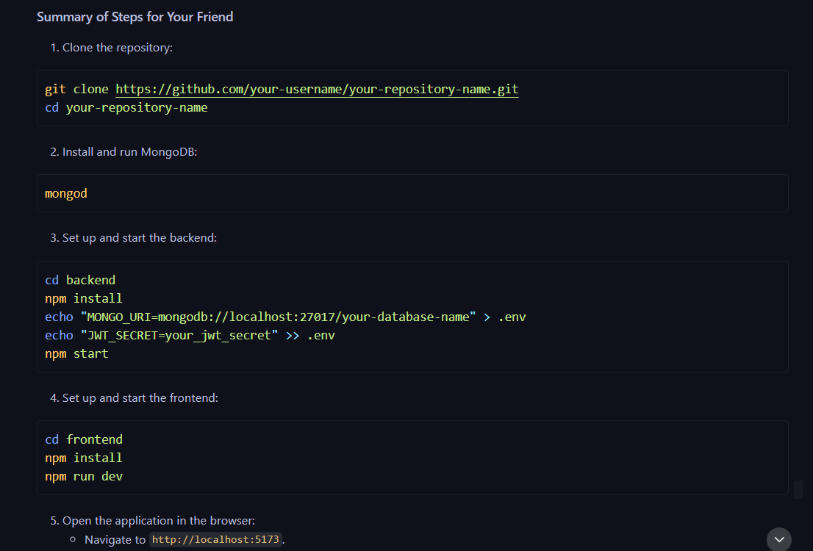

# Mini Course Planner

This is a mini course planner application that allows users to plan their courses, upload syllabi, and manage their schedules. The application is built with a React frontend and an Express backend, and it uses MongoDB for data storage.

## Features

- User authentication (registration and login)
- Course planning
- Date range selection
- Weekday selection
- Date filtering
- Syllabus upload

## Getting Started

Follow the instructions given in  to set up and run the project on your local machine.

